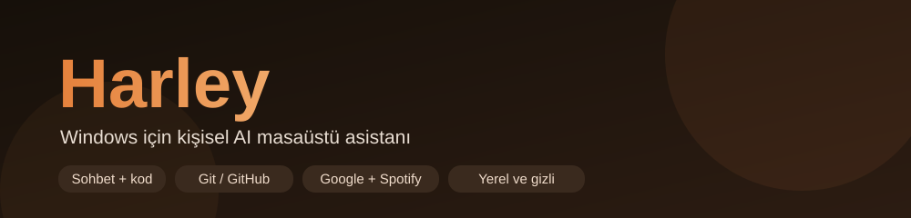
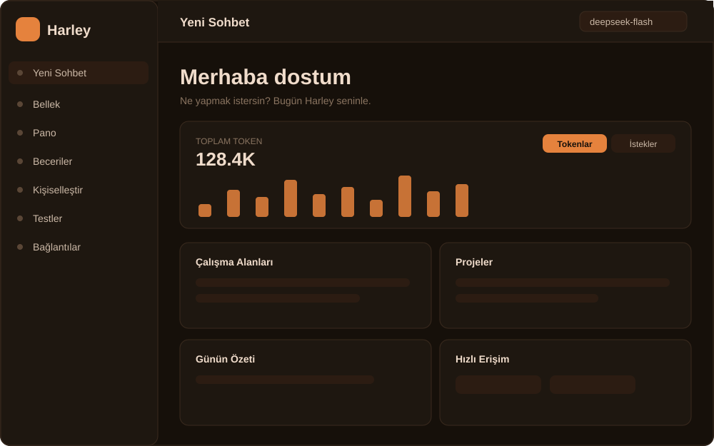

# Harley



Windows için kişisel AI masaüstü asistanı. Electron ile yazıldı; sohbet doğrudan
**DeepSeek bulut API**'sine gider. Kendi anahtarlarını bağlarsın — hepsi yalnızca
senin bilgisayarında saklanır.

> Bu depo, Harley'nin **yeni kullanıcılar** için hazırlanmış sürümüdür. İlk açılışta
> basit bir kurulum sihirbazı seni karşılar; dilediğin servisi bağlar, dilediğini atlarsın.

## İndir (hazır .exe)

**Kolay yol:** [Son sürümü indir](https://github.com/flewqiee/harley/releases/latest) →
`Harley-<sürüm>.exe` (portable, kurulum gerektirmez) → çalıştır → sihirbazdan DeepSeek
anahtarını gir.

> Windows taşınabilir (portable) sürümdür; imzasız olduğu için Windows SmartScreen
> uyarısı çıkabilir ("Yine de çalıştır"). Geliştirici olarak kaynaktan çalıştırmayı
> tercih ediyorsan aşağıdaki **Kurulum** bölümüne bak.

## Özellikler

- **Sohbet:** Türkçe, akışlı (streaming) yanıt, oturum geçmişi, araç çağırma (function-calling).
- **Çalışma alanı:** Bir proje klasörü bağla; Harley dosya okur/yazar, komut çalıştırır, test eder.
- **GitHub:** Repo oluştur/bağla, commit/push (her yazma işlemi onay ister), issue'lar, CI üretir.
- **Google:** Takvim, Gmail, Drive, Görevler — "Günün Özeti" tek mesajda.
- **Spotify:** Arama ve oynatma (PKCE ile).
- **Robotik/oyun:** Roblox Studio köprüsü (MCP) ile Luau çalıştırma/script düzenleme.
- **Ses:** Microsoft Edge neural TTS (varsayılan), yerel Piper yedeği, yerel Whisper ile sesli komut.
- **Kişiselleştirme:** Yazma tonu, kod stili, rutin öğrenme; şifreli profil.
- **Ekstra:** Hatırlatıcılar, pano geçmişi, hava durumu, günaydın rutini, otomatik hafıza, masaüstü karakteri.

## Ekran görüntüsü



> Yukarıdaki, ana menünün (hub) stilize bir önizlemesidir.

## Gereksinimler

- **Windows 10/11**
- **Node.js 18+** (önerilir: 20+)
- İnternet bağlantısı (bulut model + bazı servisler için)

## Kurulum

```bash
git clone https://github.com/<kullanici>/harley.git
cd harley/app
npm install
npm start
```

İlk açılışta:
1. Kısa bir **rehber** (onboarding) gösterilir.
2. Ardından **kurulum sihirbazı** açılır — adını gir, DeepSeek anahtarını yapıştır.
3. Diğer servisleri (Google, GitHub, Spotify) isteğe bağlı olarak bağla.

### Bağlantılar (BYO anahtar)

Uygulama içindeki **Bağlantılar** panelinden yönetilir:

| Servis | Ne için | Nereden alınır |
|---|---|---|
| **DeepSeek** (zorunlu) | Sohbet | https://platform.deepseek.com/api_keys |
| **Google** (opsiyonel) | Takvim / Gmail / Drive / Görevler | Google Cloud → OAuth istemcisi (Masaüstü uygulaması) |
| **GitHub** (opsiyonel) | Repo / commit / push / issue | https://github.com/settings/tokens |
| **Spotify** (opsiyonel) | Müzik arama / oynatma | https://developer.spotify.com/dashboard |

Tüm anahtarlar `%USERPROFILE%\HarleyDosyalar\` altındaki JSON dosyalarında, yalnızca
bu bilgisayarda tutulur. Sohbetten geçmez.

## Veri konumları

| Ne | Nerede |
|---|---|
| Anahtarlar / ayarlar / hafıza | `%USERPROFILE%\HarleyDosyalar\` |
| Kişisel ayarlar & profil | `%APPDATA%\harley\` (Electron userData) |
| Kod çalışma alanı | `%USERPROFILE%\HarleyKod\` |

## Testler (yerel)

```bash
cd app
node --test        # veya: npm test
```

**Push öncesi otomatik test:** Depoda bir `pre-push` hook'u var. Etkinleştirmek için
(bir kez, klonladıktan sonra):

```bash
git config core.hooksPath .githooks
```

Artık her `git push` öncesi testler çalışır; başarısızsa push engellenir.
(bilerek atlamak için: `git push --no-verify`)

**CI:** `.github/workflows/ci.yml` her push/PR'da testleri çalıştırır (GitHub Actions).
> Not: GitHub hesabında faturalandırma kilidi varsa Actions çalışmaz — Settings → Billing.

## Derleme (paketleme)

```bash
cd app
npm run dist        # electron-builder ile kurulum/portable üretir -> app/dist
```

Windows'ta `deploy.bat` yardımcı betiği derler ve `%USERPROFILE%\Harley` konumuna kopyalar.

## Gizlilik

- Sohbet yalnızca seçtiğin sağlayıcıya (varsayılan: DeepSeek) gider.
- Google/GitHub/Spotify erişimleri senin verdiğin anahtarlarla ve senin izninle yapılır.
- GitHub'a yazma işlemleri (commit/push/issue) her zaman önce sana sorar.
- Yerel dosyaya yazma işlemleri sadece bağladığın çalışma klasöründe geçerlidir.

## Lisans

[Apache License 2.0](LICENSE) © 2026 Umut Efe Kurucay
