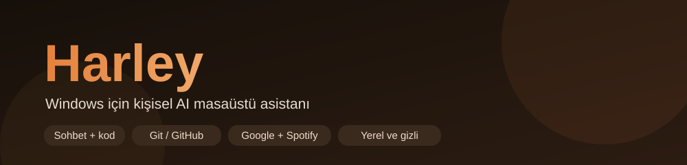
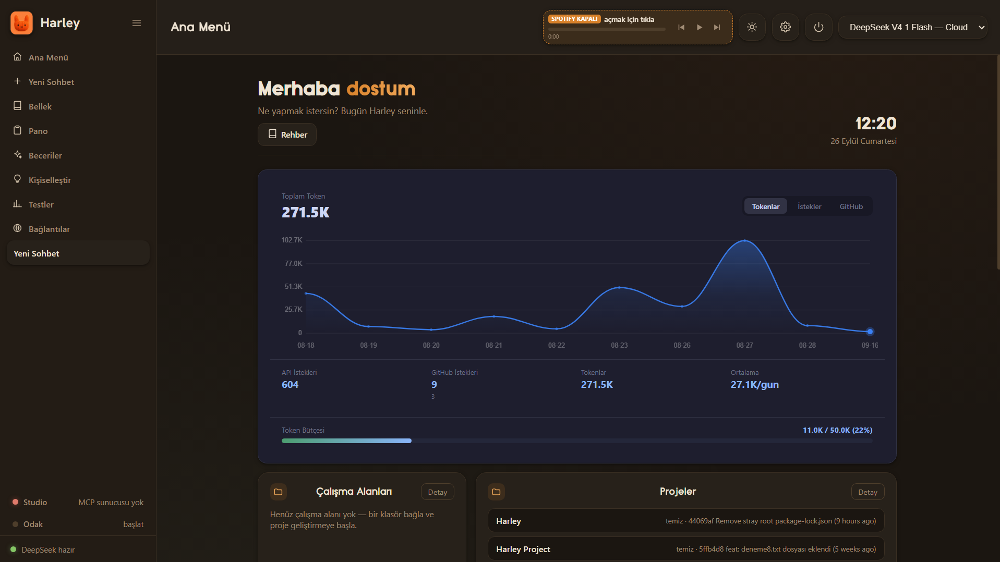

<div align="center">



# Harley

**Windows için kişisel AI masaüstü asistanı** — Electron tabanlı, gizlilik öncelikli.
Sohbet doğrudan **DeepSeek** API'sine gider; kendi anahtarlarını bağlarsın. Ara sunucu yok.

[](LICENSE)
[](#gereksinimler)
[](https://github.com/flewqiee/harley/releases/latest)
[](https://github.com/flewqiee/harley/releases)
[](https://github.com/flewqiee/harley/stargazers)
[](https://harleyai.store)

[Website](https://harleyai.store) · [İndir](https://github.com/flewqiee/harley/releases/latest) · [Özellikler](#-özellikler) · [Kurulum](#-kurulum) · [Lisans](#-lisans)

</div>

---

## ✨ Harley nedir?

Harley, bilgisayarında yaşayan samimi bir AI asistanıdır: sohbet eder, kod yazar,
projelerini geliştirir, GitHub'a gönderir, takvimini/e-postanı okur, müzik çalar ve
söylediğin işleri adım adım yapar. **Tüm anahtarların ve verilerin senin bilgisayarında kalır.**



## 🚀 İndir

<div align="center">

[](https://github.com/flewqiee/harley/releases/latest)

</div>

1. [Son sürümü indir](https://github.com/flewqiee/harley/releases/latest) → **`Harley-Setup-<sürüm>.exe`** (kurulum yerini seçersin) veya portable.
2. Kur / çalıştır.
3. İlk açılışta sihirbazdan **DeepSeek API anahtarını** gir.

> İmzasız olduğu için Windows SmartScreen uyarabilir → **Ek bilgi → Yine de çalıştır**.

## 🧩 Özellikler

| | |
|---|---|
| **Sohbet** | Akışlı yanıt, oturum geçmişi, araç çağırma (function-calling), TR/EN |
| **Çalışma alanı** | Klasör bağla → dosya oku/yaz, komut çalıştır, test et |
| **Git / GitHub** | Repo oluştur/bağla, commit, push (force-with-lease), issue, CI — hepsi onaylı |
| **Google** | Takvim, Gmail, Drive, Görevler — "Günün Özeti" |
| **Spotify** | Arama + oynatma; üst mini-player |
| **Roblox Studio** | MCP köprüsü ile Luau çalıştır / script oku-yaz (isteğe bağlı) |
| **Ses** | Edge neural TTS + yerel Piper yedeği + Whisper ile sesli komut |
| **Kişiselleştirme** | Yazma tonu, kod stili, rutin öğrenme (şifreli profil) |
| **Ekstra** | Hatırlatıcı, pano geçmişi, hava durumu, günaydın rutini, otomatik hafıza, test çalıştırıcı |

## 🛠 Kurulum

### Kolay yol (indir-çalıştır)
Yukarıdaki **İndir** bağlantısından `Harley-Setup-*.exe` → kur → çalıştır.

### Kaynaktan (geliştirici)
```bash
git clone https://github.com/flewqiee/harley.git
cd harley/app
npm install
npm start
```

### 🔌 Bağlantılar (kendi anahtarınla)

Uygulama içindeki **Bağlantılar** panelinden yönetilir:

| Servis | Ne için | Nereden |
|---|---|---|
| **DeepSeek** (zorunlu) | Sohbet | [platform.deepseek.com/api_keys](https://platform.deepseek.com/api_keys) |
| **Google** (opsiyonel) | Takvim / Gmail / Drive / Görevler | Google Cloud → OAuth (Masaüstü uygulaması) |
| **GitHub** (opsiyonel) | Repo / commit / push / issue | [github.com/settings/tokens](https://github.com/settings/tokens) |
| **Spotify** (opsiyonel) | Müzik arama / oynatma | [developer.spotify.com/dashboard](https://developer.spotify.com/dashboard) |

Anahtarlar **işletim sistemi şifrelemesiyle** (DPAPI / safeStorage) saklanır; sadece bu bilgisayarda.

## 📂 Veri konumları

| Ne | Nerede |
|---|---|
| Anahtarlar / hafıza / hatırlatmalar / pano | `%USERPROFILE%\HarleyDosyalar\` |
| Kişisel ayarlar & profil | `%APPDATA%\harley\` |
| Kod çalışma alanı | `%USERPROFILE%\HarleyKod\` |

## 🔐 Gizlilik

- Sohbet yalnızca seçtiğin sağlayıcıya (varsayılan: DeepSeek) gider — Harley sunucusu **yoktur**.
- Google / GitHub / Spotify yalnızca **sen bağlarsan** ve **senin anahtarınla** çalışır.
- GitHub'a yazma işlemleri (commit/push/issue) **her zaman önce onayını ister**.

## 🗑️ Kaldırma

Harley **portable/kurulum** sürümlerinde **servis veya kayıt defteri bırakmaz**.
- Uygulamayı sil (kurulumluysa Program Ekle/Kaldır).
- Verilerini temizle: **Ayarlar → Verilerim → Tüm verileri sil**, ya da `uninstall.bat`.
- Elle: `%USERPROFILE%\HarleyDosyalar`, `%APPDATA%\harley`, `%USERPROFILE%\HarleySes`, `%USERPROFILE%\HarleyMCP`.

## 🧪 Geliştirme

```bash
cd app
node --test          # testler
npm run dist         # .exe üretir -> app/dist
```

Push öncesi otomatik test için (bir kez): `git config core.hooksPath .githooks`

## 🤝 Katkı

Katkılar memnuniyetle! Proje **çift lisanslı** (GPLv3 + ticari). Katkıda bulunmadan önce
[docs/LICENSING.md](docs/LICENSING.md) (CLA notu) dosyasına bak. Beğendiysen **yıldız** ver ⭐

## 💛 Destek / Bağış

Harley tamamen ücretsiz. Destek olmak istersen: **[ByNoGame](https://donate.bynogame.com/flewqiee)**.

## 📄 Lisans

**GNU GPLv3 (veya sonrası)** · © 2026 Umut Efe Kurucay · [LICENSE](LICENSE)
